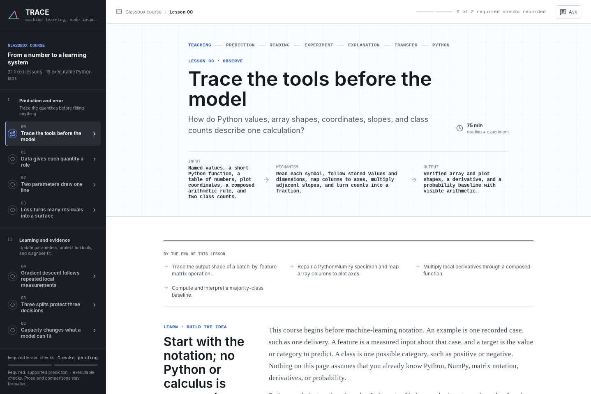

# Trace ML

[](https://github.com/avifenesh/trace-ml/actions/workflows/ci.yml)
[](https://github.com/avifenesh/trace-ml/actions/workflows/macos-build.yml)
[](LICENSE)

Trace ML is a fixed, research-grounded machine-learning course for beginners,
delivered as a React web app and a Tauri desktop app. Its 21 lessons are
authored in advance, visible from the first run, and studied without handing
curriculum control to an LLM.

> **Pre-release:** Trace ML is currently distributed from source. There are no
> supported downloadable desktop binaries yet.

## Quick Start

After installing the platform prerequisites below:

```bash
git clone https://github.com/avifenesh/trace-ml.git
cd trace-ml
make doctor
make first-run
```

`make first-run` installs pinned dependencies, verifies the source, builds the
native app, installs it for the current user, and opens it. Later, open
**Trace ML** from the Linux applications menu or desktop, from
`~/Applications` or Spotlight on macOS, or run `make start`.



All course material remains available without Bedrock credentials. The optional
helper answers questions about the current authored page, and the optional prose
reviewer gives bounded formative direction; neither can create, select, reorder,
unlock, or replace lessons.

## Prerequisites

Trace ML builds natively on Linux and macOS. Install the latest Node 24 LTS
(24.15.0 or newer), Rust through `rustup`, and GNU Make or the Make supplied by
your platform. `rust-toolchain.toml` selects the reproducible Rust `1.97.1`
toolchain automatically.

On macOS 13.5 or newer, the minimum supported by the recommended Node 24
binaries, install Apple's desktop build tools:

```bash
xcode-select --install
```

On Debian or Ubuntu, install the
[official Tauri prerequisites](https://v2.tauri.app/start/prerequisites/):

```bash
sudo apt update
sudo apt install libwebkit2gtk-4.1-dev \
  build-essential \
  curl \
  desktop-file-utils \
  wget \
  file \
  libglib2.0-bin \
  libgtk-3-bin \
  gtk-update-icon-cache \
  libxdo-dev \
  libssl-dev \
  libayatana-appindicator3-dev \
  librsvg2-dev \
  pkg-config
```

On macOS the app is installed at `~/Applications/Trace ML.app`. On Linux it is
installed for the current user with applications-menu and desktop launchers.
The menu entry is portable across freedesktop environments. Desktop-file trust
metadata is applied when the environment supports the GNOME/GVfs attribute;
other desktops use their own executable-launcher policy.
Google Chrome is needed only by the contributor Playwright suite, not to build,
install, or run the course.

The application works without Bedrock credentials by using its local,
page-grounded fallback. To enable semantic Q&A and prose review in a
Finder-launched macOS app or the managed Tailnet web service, put
`AWS_BEARER_TOKEN_BEDROCK=<your token>` in
`~/.config/claude/bedrock.env` and restrict that file to the current user with
`chmod 600`. Never commit that file or token.

Git synchronizes the authored course and application code. Learner progress and
helper conversations remain local to each machine and are not synced through
GitHub.

## Course

The course contains seven authored modules:

| Module | Lessons |
| --- | ---: |
| Prediction and error | 4 |
| Learning and evidence | 3 |
| Decisions and features | 3 |
| Model families | 3 |
| Neural mechanisms | 3 |
| Representation and sequence | 3 |
| Acting and deployment | 2 |

Lessons combine authored reading with prediction, mechanism manipulation,
explanation or transfer prompts, and, where specified, executable code. The
current course includes 19 Python labs and 41 optional external resources:
23 readings, 12 interactives, two videos, and four combined video-and-reading
pages. Opening a resource records exposure only; authored activities provide
immediate evidence without inferring retention or mastery.

Lesson completion uses only objectively checkable prediction and code
activities. In the desktop app and managed Tailnet build, a bounded Bedrock
model classifies prose against the current authored page and rubric. Rust
derives the formative level and renders novice-appropriate revision direction
from authored course strings; the model cannot write feedback or replacement
teaching. It accepts reasonable paraphrases and does not require expert wording.
Ordinary browser builds retain a deterministic structure-only fallback.

The prose assessor may label the submitted activity `unsupported`, `partial`,
or `demonstrated`, but that immediate formative label is not evidence of
retention or mastery and is excluded from lesson completion. It cannot change
the rubric, lesson sequence, course material, helper conversation, or learner
access.

Controlled comparisons remain saved experiment state rather than comprehension
evidence. None of these signals claims durable retention, unlocks, generates, or
reorders course material. Free-form explanation and transfer prompts remain
formative drafts and never control access or objective completion.

The 204 focused reading paragraphs and 489 teaching chunks form 693
source-linked page chunks backed by a 109-source research registry. Compact
editorial citations under teaching and reading blocks are separate from
optional resources and never record learner activity.

Every lesson begins with its outcomes, an authored explanation, essential
terms, one complete worked example, misconception corrections, and then an
analogous prediction whose answer was not already shown. Committing either a
supported or unsupported prediction enables the interactive mechanism and code
labs; correctness changes the feedback, not course access.

## Page-Grounded Helper

The optional helper answers questions about the current lesson. In the desktop
app and managed Tailnet build, a bounded Bedrock model explains page wording;
ordinary browser builds use a deterministic exact-page fallback. Neither path
is an LLM-directed teacher:

- Rust resolves only the active lesson and revision from generated manifests
  compiled into the desktop app or Tailnet bridge.
- Every semantic claim carries an adjacent page citation and an exact authored
  quote that Rust validates before the answer reaches the webview.
- A deterministic preflight rejects grading, hints, activity answers,
  generated material, sequencing, progression, prompt overrides, and
  cross-page requests before inference.
- The browser fallback retrieves up to three page chunks and uses CBR-style
  question frames that never supply facts.
- If the active page does not support an answer, the helper abstains.
- It never creates or selects material, teaches a separate lesson, sequences
  work, grades, estimates mastery, unlocks lessons, or changes progress.

The helper and prose assessor are separate features. Asking the helper to grade
an answer is still refused; only the authored explanation form can invoke the
bounded rubric review.

Conversation history is stored in separate lesson-scoped threads. Each answer
is still grounded from the submitted question and the current page, rather than
using chat history as course content or learning evidence.

## Local Python

Python labs run locally in a dedicated Web Worker using pinned Pyodide
`314.0.3` and Python `3.14.2`. There is no remote execution service.

`predev` and `prebuild` copy the Pyodide module, WebAssembly binary, lockfile,
and standard library from `node_modules/pyodide` into the ignored
`public/pyodide/` directory. The sync step also downloads any missing
scientific wheels and verifies each one against its pinned SHA-256 digest.
Vite and Tauri then serve every runtime asset from the same origin; lesson
execution never fetches a package from the network. The development server
also sets the cross-origin isolation headers needed for interrupt support.

Every practice run starts in a fresh worker and destroys it afterward. **Check
work** likewise runs the submitted code and authored checks in a separate fresh
worker, with a fixed seed, timeout, and output quota, then destroys that worker.
Stop, timeout, lesson navigation, and component teardown all force termination
after a short cooperative-interrupt grace period. Fourteen labs use the Python
standard library only.
Five scientific labs load pinned, checksum-verified local wheels for NumPy
`2.4.3`, scikit-learn `1.8.0`, or autograd `1.9.1`; no package is fetched at
lesson runtime.

The worker exposes a frozen empty `js` module, revokes Pyodide's
`pyodide_js` bridge after package loading, and communicates with the app over
a transferred private `MessagePort`. Learner code is synchronous and cannot
use browser APIs. Every protocol message is runtime-validated, and stdout,
stderr, result, check, and error strings are UTF-8 byte-capped before
structured cloning.

This is browser-process isolation, not an OS sandbox. Timeouts can terminate a
worker, but WebAssembly in the browser does not provide an enforceable
per-execution Python heap limit. A memory-exhausting submission can therefore
still pressure or terminate the worker process; no learner code or secrets
should be treated as mutually distrusting within that browser process.

## Persistence

Trace ML persists local state with `localStorage`:

- `trace-ml:learner-record:v1`: activity attempts, resource opens, and concept
  evidence.
- `trace-ml:tutor-threads:v1`: lesson-scoped helper conversations.
- `trace-ml:tutor-thread-deleted:v1:*`: durable per-thread deletion markers
  that prevent stale same-origin windows from restoring deleted conversations.
- `trace-ml:active-thread:v1`: the selected helper thread.
- `trace-ml:active-lesson:v1`: the last selected authored lesson.
- `trace-ml:activity-state:v1:*`: revision-scoped drafts and formative prose
  feedback.

State belongs to the current browser or Tauri webview profile. There is no
account or cloud sync, and clearing site storage resets it. Same-origin windows
serialize learner-record writes with the Web Locks API, re-read and merge the
latest ledger inside the lock, and synchronize subsequent storage events.
Helper threads merge ordinary concurrent writes and honor explicit deletion
markers rather than inferring deletion from an absent record. Malformed or
orphaned evidence is discarded during normalization.

Desktop and managed Tailnet Q&A send the current authored lesson, the question,
and bounded recent thread context to the configured Amazon Bedrock model.
Their prose review sends the authored lesson text, activity prompt and
guidance, rubric labels, and the submitted draft. The client supplies only
authored IDs and learner text; Rust resolves trusted material from generated
manifests compiled into the app or host-side bridge. The backend sends direct
HTTPS requests to the documented Mantle Responses endpoint with strict
structured output, `tool_choice: "none"`, `store: false`, fixed timeouts,
bounded input and output, request cancellation, and per-feature rate limits.
The protected credential remains in the native process on desktop and on the
Linux host for Tailnet access. Ordinary browser Q&A and structure checks send
nothing remotely. `store: false`
disables retrievable Responses state but does not guarantee zero retention;
AWS documents that classifier-flagged GPT-5.6 Sol traffic may be retained for
up to 30 days. Account/project retention and provider-sharing policy still
apply. Live model metadata reported `provider_data_share` on 2026-08-06, so
this installation does not establish zero data retention.

If browser storage is unavailable, activity continues in memory for that
session and the compact toolbar displays **Session only**. That warning means
the current evidence will not survive a reload.

## Phone access over Tailscale

On a Linux host connected to Tailscale, install the production web build and
its bounded Bedrock bridge as a user service, then expose it only inside the
same tailnet. Before installing:

- Sign in to Tailscale on both the host and phone, and confirm `tailscale status`
  succeeds on the host.
- Enable [HTTPS certificates](https://tailscale.com/docs/how-to/set-up-https-certificates)
  for the tailnet. This may require a tailnet administrator.
- Ensure the [tailnet access policy](https://tailscale.com/docs/features/access-control)
  lets the phone's user or device reach the host on TCP port `9443`.
- Use a Linux login with a systemd user manager and `flock` from `util-linux`.
- Install the Rust toolchain declared in `rust-toolchain.toml`; Tailnet releases
  compile the same Rust validation boundary used by the desktop app.
- Install Tailscale from its Linux packages or the
  [Canonical Snap](https://github.com/canonical/tailscale-snap). For Snap
  installs, Trace ML resolves the root-owned client and daemon socket during
  installation so the service can retain `NoNewPrivileges=yes`.

Then install the service:

```bash
make tailnet-install
```

The command installs the pinned npm dependencies, builds a versioned web
release and Rust Bedrock bridge, starts `trace-ml-web.service`, and creates a
dedicated Tailscale Serve endpoint on HTTPS port `9443`. The server listens only
on `127.0.0.1:5600`; Tailscale supplies the private HTTPS connection. Bedrock
requests are accepted only by fixed same-origin course routes, and the bridge
never exposes a generic prompt or model endpoint. It does not use Funnel and is
not public on the internet. The installer refuses endpoints with another proxy,
sibling handlers, a foreground Serve session, or Funnel enabled. The Bedrock
routes also reject Tailscale's Funnel request marker. Before each
credential-backed operation, the host verifies that the exact private Serve
route is still owned by Trace ML and that no HTTP or TLS-terminated TCP Funnel
forwards to its loopback backend. Unrelated Funnel routes for other local
services remain valid.

Helper and prose requests use unique cancellation IDs per browser action.
Concurrency and rate limits remain host-global across connected Tailnet
browsers so opening more tabs cannot multiply Bedrock work.

The command prints the exact URL, in this form:

```text
https://<machine>.<tailnet>.ts.net:9443/
```

Open that URL in Chrome on an Android phone signed into the same tailnet. Use
**Add to Home screen** for the Trace icon and a standalone course window.
Progress remains local to that phone's browser profile; it does not sync with
the desktop app.

The service uses systemd's user manager. User lingering keeps it available
after logout and before the next login; the installer reports when lingering
is disabled. Tailscale Serve runs in background mode, which
[resumes sharing after a reboot](https://tailscale.com/docs/reference/tailscale-cli/serve).
Lifecycle commands take a non-blocking `flock`; a concurrent install, restart,
start, stop, or uninstall is rejected instead of racing the active command.

Use the lifecycle commands after installation:

```bash
make tailnet-status
make tailnet-restart  # rebuild after pulling new course changes
make tailnet-stop
make tailnet-start
make tailnet-uninstall
```

`tailnet-stop` and `tailnet-uninstall` remove only Trace ML's dedicated Serve
route. They preserve every unrelated Tailscale Serve or Funnel route.
`tailnet-restart` builds and validates a new immutable release before switching
the service, and keeps the previous release for rollback. `tailnet-uninstall`
also removes Trace ML's managed releases.

Override the defaults during installation when another local service already
owns either port:

```bash
TRACE_ML_WEB_PORT=5601 \
TRACE_ML_TAILNET_HTTPS_PORT=9444 \
make tailnet-install
```

Those values are stored in
`${XDG_CONFIG_HOME:-$HOME/.config}/trace-ml/tailnet.conf`, so start, restart,
status, stop, and uninstall all continue to use the same ports. Versioned web
releases use `${XDG_DATA_HOME:-$HOME/.local/share}/trace-ml-web/releases`.
Changing installed ports is intentionally not an in-place operation: uninstall
the service first, then reinstall with the new values.

If uninstall cannot contact Tailscale or remove the owned route, it removes the
local service and managed releases but retains the port configuration. After
Tailscale reconnects and the endpoint is exclusively owned by Trace ML again,
run the ownership-checked cleanup printed by the command:

```bash
make tailnet-uninstall
```

The command never recommends port-wide removal when the endpoint belongs to a
different proxy, a foreground Serve session, or Funnel.

## Development

The desktop build requires Node `^22.22.2`, `^24.15.0`, or `>=26.0.0`, npm,
the pinned Rust `1.97.1` toolchain (the crate remains compatible with Rust
`1.88.0` or newer), and the operating-system prerequisites below. The latest
Node 24 LTS is recommended; `.nvmrc` and `rust-toolchain.toml` select the
expected toolchains.

The portable Make targets are:

| Command | Purpose |
| --- | --- |
| `make doctor` | Check Node, Rust, and native desktop prerequisites |
| `make setup` | Install dependencies and local runtime assets |
| `make web` | Start browser development on `127.0.0.1:5173` |
| `make dev` | Start Tauri desktop development |
| `make check` | Run all fast JavaScript and Rust quality gates |
| `make test-e2e` | Run browser and real-Pyodide integration tests |
| `make build` | Build distributable bundles for the current operating system |
| `make install` | Verify, build, and install the native app |
| `make smoke` | Exercise the exact installed app and process |
| `make start` | Open the installed native app |
| `make dmg` | Build a macOS DMG on a Mac |
| `make tailnet-install` | Build and install private phone access on Linux |
| `make tailnet-restart` | Rebuild and restart the installed phone service |
| `make tailnet-status` | Check local and tailnet phone access |
| `make tailnet-stop` | Stop phone access and remove its dedicated route |

The equivalent npm-only browser setup remains:

```bash
npm ci
npm run dev
```

The app is served at `http://127.0.0.1:5173`; that port is strict. `npm run dev`
automatically synchronizes the local Pyodide assets.

| Command | Purpose |
| --- | --- |
| `npm run sync:pyodide` | Refresh `public/pyodide/` from the pinned package |
| `npm run check:manifests` | Verify generated lesson authority |
| `npm run typecheck` | Run the TypeScript project build checks |
| `npm run lint` | Run Oxlint |
| `npm test` | Run the Vitest unit suite |
| `npm run build` | Sync Pyodide, typecheck, and build the Vite app |
| `npm run preview` | Serve the production Vite build locally |
| `npm run serve:production` | Serve a built `dist/` on loopback with runtime headers |

## End-to-End Tests

Install [Google Chrome](https://www.google.com/chrome/) before running the
Playwright suite:

```bash
npm run test:e2e
```

Playwright uses the installed Google Chrome channel at a `1440x1000` viewport.
It allocates isolated loopback ports and runs the production course, responsive
layouts, runtime boundaries, and five authored-lab batches as separate
projects. Each project receives a fresh browser process, scientific package
cases run serially, and one worker keeps multi-window persistence cases from
interfering with one another. The suite stops after the first failure instead
of repeatedly launching browsers on a resource-starved host. Browser
course-flow tests and the real Pyodide runtime tests live in `e2e/`; ignored
failure traces are written to `outputs/playwright/`.

## Tauri Desktop

The desktop shell uses Tauri 2 and must be built on the target operating
system. Run `make doctor` before setup.

### macOS

Building this repository with the recommended Node 24 toolchain requires macOS
13.5 or newer. Tauri's own native prerequisites cover Catalina 10.15 and later,
but that lower floor does not satisfy this repository's Node toolchain.
Desktop-only builds can use Xcode Command Line Tools:

```bash
xcode-select --install
```

`make install` runs the core quality gates, builds the official Tauri `.app`
bundle on that Mac, validates its bundle identifier, executable, and `.icns`
icon, then transactionally installs it to `~/Applications/Trace ML.app`.
An ordinary installer failure restores the previous app; power loss or
`SIGKILL` during replacement may require rebuilding it with `make install`.
`make start` opens the installed app through macOS Launch Services.

To produce a drag-to-Applications installer on a Mac:

```bash
make dmg
```

Local source builds are intended for personal use. Sharing a binary with other
Mac users requires Apple Developer ID signing and notarization; the repository
does not contain signing credentials.

### Linux

Install the Linux packages listed in [Prerequisites](#prerequisites) before
running native development or release commands.

Run the desktop app in development on either supported operating system:

```bash
make dev
```

Build, test, and install the production native app:

```bash
make install
```

On Linux, the install command runs the fast quality gates, builds the locked
release binary without spending time on distributable package formats, installs
that exact artifact, and leaves it ready for a normal desktop launch. The
low-level installer is idempotent. It copies the release binary from
`src-tauri/target/release/trace-ml`, installs the project license and third-party
notices, installs the hicolor icon at 32, 64, 128,
256, and 512 pixels, refreshes the desktop and icon caches, and creates both
the **Trace ML** applications-menu entry and `Trace ML.desktop` in the
configured XDG desktop directory.
To install a different release artifact, run
`scripts/install-linux-desktop.sh --binary /absolute/path/to/trace-ml`.

For the maintainer action test, install `gjs`, `at-spi2-core`, `xdotool`,
`x11-utils`, and `iproute2`, then run `make smoke` from an X11 or XWayland
desktop session. The smoke test deliberately fails while anything is listening
on port `5173`.
It activates the installed desktop file, establishes cleanup ownership for the
new process, proves the window's `/proc` executable and `WM_CLASS`, resolves
the installed icon through GTK, starts a fresh helper conversation, submits an
authored page question, and requires a completed local or Bedrock response. Run
`npm run desktop:smoke -- --require-bedrock` on Linux for the optional credentialed
semantic-readiness check.
Startup diagnostics are written to `~/.cache/trace-ml/launcher.log`.

The `macOS build` GitHub Actions workflow compiles and validates the `.app`
bundle on both Apple Silicon and Intel macOS runners after every push to
`main`.

Tauri uses `devUrl` only for development and embeds `frontendDist` in release
builds. The bundle category follows the official
[Tauri 2 configuration reference](https://v2.tauri.app/reference/config/);
the installed entries follow the freedesktop
[Desktop Entry](https://specifications.freedesktop.org/desktop-entry-spec/latest/)
and [Icon Theme](https://specifications.freedesktop.org/icon-theme-spec/latest/)
specifications. The macOS setup and bundle commands follow the official
[prerequisites](https://v2.tauri.app/start/prerequisites/),
[application bundle](https://v2.tauri.app/distribute/macos-application-bundle/),
and [DMG](https://v2.tauri.app/distribute/dmg/) guides (accessed 2026-08-05).

## Repository Map

- `src/content/`: the fixed course, lesson types, activities, resources, and
  authored checks.
- `src/learning/`: evidence recording, rubrics, progression state, and local
  learner persistence, including the bounded prose-assessment client.
- `src/tutor/`: page-chunk retrieval, CBR response framing, and persisted
  lesson threads.
- `src/runtime/`: the Pyodide worker, execution limits, and clean assessment
  protocol.
- `e2e/`: browser course-flow and real-runtime Playwright tests.
- `src-tauri/`: Tauri 2 application, permissions, bundle configuration, and
  the compiled authored-rubric manifest and validated direct-Bedrock command.

The research synthesis is in
[`agent-knowledge/ml-course-research.md`](agent-knowledge/ml-course-research.md).
Its 109-source registry is
[`agent-knowledge/resources/ml-course-research-sources.json`](agent-knowledge/resources/ml-course-research-sources.json).
Source IDs in lesson content resolve against that registry; the guide also
records synthesized design decisions and known evidence gaps.

## Limitations

- Trace ML is a local, single-user application. It has no account, cloud
  progress sync, cohort management, or learning-management-system integration.
- Pyodide isolates runs in disposable browser workers, not an OS sandbox. A
  memory-exhausting submission can still pressure its renderer process.
- Bedrock is optional, but semantic helper and prose review require a supported
  credential and network connection in the desktop app or managed Tailnet
  service.
- Local macOS builds are suitable for personal use. Distribution to other Mac
  users requires Apple Developer ID signing and notarization.
- The first public release is source-only. Downloadable desktop binaries also
  require a complete bundled third-party license report before publication.

## Project Health

- Read [CONTRIBUTING.md](CONTRIBUTING.md) before changing course material or
  runtime boundaries.
- Report vulnerabilities privately through [SECURITY.md](SECURITY.md).
- Community participation follows [CODE_OF_CONDUCT.md](CODE_OF_CONDUCT.md).
- Release history is recorded in [CHANGELOG.md](CHANGELOG.md).
- Citation metadata is available in [CITATION.cff](CITATION.cff).

## License

Original Trace ML code and authored course material are available under the
[MIT License](LICENSE). Third-party libraries and bundled runtime components
retain their own licenses; see [THIRD_PARTY_NOTICES.md](THIRD_PARTY_NOTICES.md).
